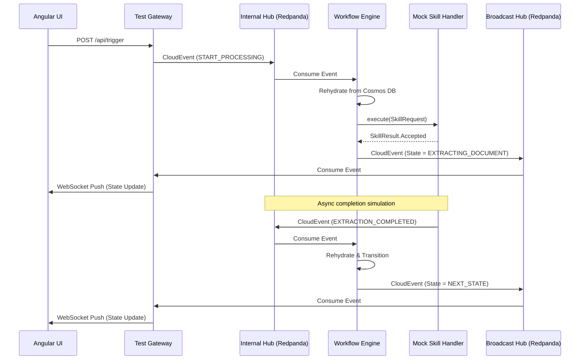

# ADR 0009 — YAML-Driven Metadata Workflow Engine (Spring Boot 4)

**Status:** Draft  
**Supersedes:** ADR 0006  
**Issue:** [#4](https://github.com/margic/custom-workflow-starter/issues/4)

---

## Context

The existing starter (ADR 0006) used Kogito 10.1.0 to parse CNCF Serverless Workflow `.sw.json`
definitions and generate Spring Boot REST endpoints at build time. Kogito 10.1.0 is incompatible
with Spring Boot 4.0 / Spring Framework 7. No compatible Kogito release exists.

This ADR replaces Kogito with a runtime-interpreted YAML DSL backed by Spring Statemachine,
with state persistence in Cosmos DB and event-driven orchestration via Azure Event Hubs and the
CloudEvents 1.0 standard.

---

## Decision

Replace the Kogito-based codegen model with a **runtime YAML engine** that:

- Parses workflow YAML at application startup and constructs `StateMachineModel` instances dynamically
- Persists `StateMachineContext` to Cosmos DB keyed by `controlRecordId`
- Consumes CloudEvents from an internal Azure Event Hub (KEDA-scaled consumers)
- Invokes coarse-grained skills via `skill://` URIs through a Skill SDK
- Emits state change CloudEvents to a broadcast Event Hub for downstream consumers and WebSocket UI push

---

## Tech Stack Upgrade: Java 21 Requirement

While Spring Boot 4.0 dictates a minimum baseline of Java 17, this project explicitly mandates an upgrade to **Java 21**. Doing so yields two major architectural benefits for a concurrent event-driven engine:

1. **Virtual Threads (Project Loom):** By enabling `spring.threads.virtual.enabled=true`, the KEDA Event Hub consumers and REST endpoints will use lightweight virtual threads rather than expensive OS threads. This vastly increases the concurrent throughput of CloudEvent processing and skill invocations, eliminating thread exhaustion risks under heavy load.
2. **Switch Pattern Matching:** Java 21 enables exhaustive `switch` block pattern matching over our sealed interface API (`SkillResult`). This cleanly routes `Accepted`, `Completed`, and `Failed` asynchronous outcomes using modern semantics, avoiding clunky `if-else` and `instanceof` blocks.
3. **Record Patterns:** Cleaner extraction and mapping of `CloudEvent` payload records.

---

## Dependency Versions

| Dependency | Version | Notes |
|---|---|---|
| **Java** | 21 | Required for virtual threads and pattern matching |
| **Spring Boot** | 4.0.x | Auto-configuration, actuator, Micrometer |
| **Spring Statemachine** | 4.0.x | Must align with Spring Framework 7 (ships with Boot 4) |
| **Spring Kafka** | 3.3.x | Kafka consumer/producer; compatible with Azure Event Hubs Kafka protocol |
| **Drools DMN Engine** | 10.1.x | `kie-dmn-core` standalone — no Kogito auto-config dependency |
| **CloudEvents Java SDK** | 4.x | `io.cloudevents:cloudevents-kafka`, `cloudevents-json-jackson` |
| **Azure Cosmos DB Spring Data** | 5.x | `azure-spring-data-cosmos` for Spring Boot 4 |
| **Micrometer** | 1.14.x | Ships with Spring Boot 4; exports to Application Insights |
| **Gradle** | 9.4.1 | Build tool |

---

## Module Structure

The project is reorganized into the following Gradle modules, replacing the Kogito-era structure from ADR 0006:

| Module | Purpose | Published | Phase |
|---|---|---|---|
| `anax-workflow-api` | Skill SDK interfaces (`SkillRequest`, `SkillResult`, `SkillHandler`), CloudEvent envelope types, and shared constants. Zero runtime dependencies beyond Java 21. | Yes (Maven Central) | Compile |
| `anax-workflow-engine` | Core engine: YAML DSL parser, `StateMachineModelFactory`, `StateMachinePersister`, `StateMachineInterceptor`, skill dispatcher, guard adapters (SpEL + DMN). | Yes (Maven Central) | Runtime |
| `anax-workflow-spring-boot-starter` | Spring Boot 4 auto-configuration: wires engine beans, Kafka consumers/producers, Cosmos DB persistence, Micrometer metrics, configuration properties (`anax.workflow.*`). | Yes (Maven Central) | Runtime |
| `anax-workflow-test-gateway` | Test harness: Angular UI serving, WebSocket gateway, mock skill providers, REST trigger endpoints. | No (local dev only) | Test |

### Dependency Graph

```
anax-workflow-api  (no dependencies)
       ↑
anax-workflow-engine  (depends on: api, spring-statemachine, drools-dmn, cloudevents-sdk)
       ↑
anax-workflow-spring-boot-starter  (depends on: engine, spring-boot, spring-kafka, azure-cosmos)
       ↑
anax-workflow-test-gateway  (depends on: starter, spring-websocket)
```

---

## Architecture

### Event Flow

```
External domain event
  → Event Bridge (validates + translates to CloudEvent)
  → Internal Workflow Hub
  → KEDA consumer
  → engine rehydrates state machine from Cosmos DB
  → transition + skill invocation
  → Broadcast Hub
  → WebSocket Gateway / downstream consumers
```

### Correlation

`controlRecordId` is the partition key on both Cosmos DB and Event Hub. All CloudEvents for a
workflow instance carry `subject: controlRecordId` and `partitionkey: controlRecordId`,
guaranteeing ordered, non-concurrent processing per instance.

### Async Skill Pattern (201 Accepted)

1. Transition fires → engine invokes skill via SDK (POST with `controlRecordId` + mapped payload)
2. Skill returns **201 Accepted** → engine persists context, emits broadcast CloudEvent, parks
3. Skill completes → external system emits domain event → bridge translates → Internal Hub
4. KEDA consumer claims event, extracts `subject` → Cosmos DB lookup → rehydrate → transition

---

## CloudEvents Envelope Standard

All messages flowing in and out of the workflow engine adhere to the CloudEvents 1.0 specification.
The `partitionkey` extension is enforced and must match `controlRecordId`.

```json
{
  "specversion": "1.0",
  "id": "a89b-43c2-9e8a-1132a",
  "source": "/bridge/doc-intelligence",
  "type": "EXTRACTION_COMPLETED",
  "subject": "CR-99482-11A",
  "partitionkey": "CR-99482-11A",
  "time": "2026-04-15T18:44:00Z",
  "data": {
    "extractionDataId": "ext-doc-8821"
  }
}
```

### Broadcast Hub (Outbound) CloudEvent Schema

When the engine completes a transition, it emits a `STATE_CHANGED` CloudEvent to the Broadcast Hub. Downstream consumers (Angular UI, audit systems, etc.) subscribe to this topic.

```json
{
  "specversion": "1.0",
  "id": "bc41-9921-ef02-7a3cd",
  "source": "/workflow-engine/{workflowId}",
  "type": "STATE_CHANGED",
  "subject": "CR-99482-11A",
  "partitionkey": "CR-99482-11A",
  "time": "2026-04-15T18:44:01Z",
  "data": {
    "controlRecordId": "CR-99482-11A",
    "workflowId": "legal-order-onboarding",
    "previousState": "ORDER_CAPTURED",
    "currentState": "EXTRACTING_DOCUMENT",
    "triggerEvent": "START_PROCESSING",
    "skillResult": "Accepted",
    "trackingReference": "skill-track-8821"
  }
}
```

---

## DSL Shape

Workflow definitions are YAML files committed to `src/main/resources/workflows/`. Schema version
is controlled via the `version` field on the `workflow` block.

### Key Constructs

| Construct | Purpose |
|---|---|
| `workflow` | Root — id, name, version, description, initial_state |
| `states` | Nodes of the state machine |
| `events` | Expected CloudEvent `type` values that trigger transitions |
| `transitions` | Rules connecting states: source, event, target, action |
| `action` | Executed on transition: type `skill`, `uri`, `payload_mapping` |
| `guard` | Optional condition on a transition: type `spel` or `dmn`, evaluated before the transition fires |

### State Types

| Type | Behaviour |
|---|---|
| `INITIAL` | Starting state when a new control record is created |
| `ACTIVE_WAIT` | Engine parks after invoking skill; awaits wakeup CloudEvent |
| `PARKED` | Engine emits to Broadcast Hub; awaits human or external trigger |
| `END` | Terminal state |
| `ERROR` | Terminal error state (injected automatically by the engine if not declared) |

### Reserved States

The engine automatically injects two reserved states into every workflow if the author does not explicitly declare them:

- **`ERROR`** — The engine transitions here on unhandled `SkillResult.Failed` or unexpected exceptions. The control record is marked with error details in `extendedState`.
- **`SUSPENDED`** — The engine transitions here on retryable failures (where `SkillResult.Failed.retryable == true`). Operators can push a `RETRY` CloudEvent to re-attempt the failed transition.

### Payload Mapping JSONPath Sources

| Prefix | Source |
|---|---|
| `$.extendedState.*` | Values read from Cosmos DB extended state for this control record |
| `$.event.data.*` | Values extracted from the triggering CloudEvent `data` block |

### Example DSL (Legal Order Processing)

```yaml
workflow:
  id: "legal-order-onboarding"
  name: "Legal Order Initial Automation"
  version: "1.0.0"
  description: "Automates doc extraction, validation, and party search before HITL."
  initial_state: "ORDER_CAPTURED"

  states:
    - name: "ORDER_CAPTURED"
      type: "INITIAL"
    - name: "EXTRACTING_DOCUMENT"
      type: "ACTIVE_WAIT"
    - name: "VALIDATING_EXTRACTION"
      type: "ACTIVE_WAIT"
    - name: "SEARCHING_PARTIES"
      type: "ACTIVE_WAIT"
    - name: "READY_FOR_HITL"
      type: "PARKED"
    - name: "HANDED_OFF_TO_LEGACY"
      type: "END"

  events:
    - name: "START_PROCESSING"
    - name: "EXTRACTION_COMPLETED"
    - name: "VALIDATION_COMPLETED"
    - name: "PARTY_SEARCH_COMPLETED"
    - name: "HITL_APPROVED"

  transitions:
    - source: "ORDER_CAPTURED"
      event: "START_PROCESSING"
      target: "EXTRACTING_DOCUMENT"
      guard:
        type: "dmn"
        uri: "dmn://com.anax.decisions/should-process-order"
      action:
        type: "skill"
        uri: "skill://doc-intelligence/extract-legal-order"
        payload_mapping:
          documentId: "$.extendedState.capturedDocumentId"
          location: "$.extendedState.capturedDocumentLocation"

    # Fallback transition: if the DMN guard above rejects, log and terminate
    - source: "ORDER_CAPTURED"
      event: "START_PROCESSING"
      target: "HANDED_OFF_TO_LEGACY"
      guard:
        type: "spel"
        expression: "true"
      # No action — acts as a catch-all fallback; the engine logs and moves to END.

    - source: "EXTRACTING_DOCUMENT"
      event: "EXTRACTION_COMPLETED"
      target: "VALIDATING_EXTRACTION"
      action:
        type: "skill"
        uri: "skill://legal-rules/validate-extraction"
        payload_mapping:
          extractionDataId: "$.event.data.extractionDataId"

    - source: "VALIDATING_EXTRACTION"
      event: "VALIDATION_COMPLETED"
      target: "SEARCHING_PARTIES"
      action:
        type: "skill"
        uri: "skill://customer-mdm/party-account-search"
        payload_mapping:
          parties: "$.extendedState.validatedParties"

    - source: "SEARCHING_PARTIES"
      event: "PARTY_SEARCH_COMPLETED"
      target: "READY_FOR_HITL"
      # No action — engine emits state change CloudEvent to Broadcast Hub.
      # UI reacts via WebSocket; human submits HITL_APPROVED via API trigger.

    - source: "READY_FOR_HITL"
      event: "HITL_APPROVED"
      target: "HANDED_OFF_TO_LEGACY"
      action:
        type: "skill"
        uri: "skill://legacy-integration/submit-order"
        payload_mapping:
          reviewerComments: "$.event.data.comments"
```

---

## Skill API Contract

The workflow engine interacts with external or local logic via a strictly decoupled Java API, to be published as a standalone SDK library (`anax-workflow-api` or similar). A `skill://` URI maps to a `SkillHandler` execution. 

This design completely decouples the engine from physical transports, allowing different skill implementations (e.g., local method call, REST template, gRPC, or Kafka event producer) to be provided as standard Spring beans to manage traffic and workload segregation.

```java
/** Represents the incoming request to a skill mapped from the workflow */
public interface SkillRequest<T> {
    String controlRecordId();
    String workflowInstanceId();
    String skillUri();             // e.g., "skill://doc-intelligence/extract-legal-order"
    T payload();                   // Mapped based on action.payload_mapping
    Map<String, String> headers(); // Envelope headers (trace state, etc.)
}

/** Represents the outcome of a skill invocation, encapsulating the async workflow semantics */
public sealed interface SkillResult permits 
    SkillResult.Accepted, 
    SkillResult.Completed, 
    SkillResult.Failed {
    
    // Async execution: The request was accepted by the remote system.
    // The engine MUST yield and park the workflow in ACTIVE_WAIT for a subsequent CloudEvent.
    record Accepted(String trackingReference) implements SkillResult {}
    
    // Sync execution: The operation completed immediately in-process or via blocking I/O.
    // The engine merges the output into extended state and proceeds without parking.
    record Completed<R>(R output) implements SkillResult {}
    
    // Execution failure: Synchronous error. 
    // The engine evaluates retry logic or transitions to an error/dead-letter state.
    record Failed(String errorCode, String errorMessage, boolean retryable) implements SkillResult {}
}

/** The primary interface implemented by providers */
public interface SkillHandler<T> {
    boolean supports(String skillUri);
    SkillResult execute(SkillRequest<T> request);
}
```

---

## Starter Responsibilities

| Concern | Owner |
|---|---|
| YAML DSL parser + `StateMachineModel` builder | Starter |
| Spring Statemachine engine wiring | Starter |
| Cosmos DB state persistence | Starter |
| Internal Event Hub consumer (KEDA-scaled) | Starter |
| Broadcast Event Hub producer | Starter |
| Skill SDK (`skill://` invocation + 201 handling) | Starter |
| CloudEvents envelope assembly/validation | Starter |
| Metadata server catalog registration on startup | Starter (carries over from ADR 0006) |
| Event Bridges (external → internal translation) | Consumer application |
| WebSocket Gateway | Consumer application |

---

## Control Record Lifecycle

To make the journey of a workflow concrete, here is the start-to-finish lifecycle of a `controlRecordId` persistence document:

### Workflow Routing: How an Event Finds Its Workflow Definition

An incoming CloudEvent is matched to a workflow definition via a **two-step lookup**:

1. **Existing instance?** The engine extracts the `controlRecordId` from the CloudEvent's `subject` field and attempts a Cosmos DB lookup. If a document exists, the stored `workflowId` field identifies which YAML definition to use, and the state machine is rehydrated from the persisted state.
2. **New instance?** If the Cosmos DB lookup returns no document, the engine consults a **routing table** — a map of CloudEvent `type` → `workflowId` built at startup from the YAML definitions. Each workflow YAML declares which event types target its `INITIAL` state via the `transitions` block. The engine matches the incoming `type` to find the correct workflow, generates a new `controlRecordId` (or uses the one provided in the `subject`), and initializes a new Cosmos DB document.

If neither lookup succeeds (unknown event type, no matching workflow), the event is rejected and falls to the transport's DLQ.

### Lifecycle Stages

1. **Instantiation (Birth):** A trigger CloudEvent arrives at the internal Event Hub without an existing `controlRecordId` (mapped to an `INITIAL` state event). The engine generates a new Cosmos DB document containing the new `controlRecordId`, the embedded workflow YAML snapshot, an empty `extendedState` JSON object, and sets the state to the defined `initial_state`.
2. **Active Execution:** The Spring Statemachine factory creates the state machine and evaluates guards. The engine executes synchronous skills (`SkillResult.Completed`), merging their output into `extendedState` and progressing transitions without blocking.
3. **Suspension (Parking):** The engine reaches a state typed as `ACTIVE_WAIT` or `PARKED` (often because a skill returned an async `SkillResult.Accepted`). The persister overwrites the Cosmos DB document with the updated `extendedState` and current state. The Spring Statemachine instance is then garbage collected, freeing all memory.
4. **Rehydration (Wakeup):** Days or months later, a CloudEvent arrives with a matching `controlRecordId` partition key. The engine pulls the Cosmos DB document, builds a fresh blank state machine, hydrates it to the parked state, populates `extendedState`, and resumes processing.
5. **Termination (Death):** The workflow transitions to a state typed as `END` (or is manually forced to `ERROR`). The final state is written to Cosmos DB. The control record becomes immutable and remains purely for audit logging and historical metrics.

---

## The End-to-End Execution Flow (Concurrency & Race condition Prevention)

This architecture relies heavily on **Event Hub partition key semantics** to guarantee ordered, race-condition-free execution without needing complex database locks.

**Step 1: The Trigger & Event Bridge**
1. An external system makes a REST call (e.g., `POST /api/orders`) to a consumer application acting as an **Event Bridge**.
2. The Bridge wraps the payload safely into a standard **CloudEvents 1.0 JSON envelope**. Crucially, it sets both `subject` and the Azure Event Hub extension `partitionkey` to the `controlRecordId`.

**Step 2: Hashing and Partitioning (The Event Hub)**
1. The Bridge publishes the CloudEvent to the **Internal Workflow Hub**.
2. Azure Event Hubs (or Kafka/Redpanda) hashes the `partitionkey`. 
3. **The Guarantee:** Event Hubs guarantees that *every single event* with the same partition key will always land in the exact same physical partition. This ensures strict, first-in-first-out (FIFO) ordering for that specific workflow instance.

**Step 3: Listener Consumption and Rehydration**
1. The Starter's Event Hub listener (`@KafkaListener` or Spring Cloud Stream) polls the Hub. Because of consumer group semantics, only a single worker thread will ever process the partition containing our `controlRecordId`. **This completely eliminates concurrent race conditions** on a single workflow instance.
2. The engine extracts the `controlRecordId`. It asks the `StateMachineModelFactory` for a blank state machine template.
3. It calls `StateMachinePersister.restore()`, which pulls the latest JSON document from Cosmos DB and hydrates the state machine to its current parked state and `extendedState`.

**Step 4: Transition Execution**
1. The engine feeds the CloudEvent's `type` (e.g., `START_PROCESSING`) into the hydrated state machine, triggering a transition.
2. **Guards:** It evaluates any defined Guards (SpEL or Drools DMN) using the payload data.
3. **Action:** If the guard passes, the listener thread synchronously invokes the `SkillHandler` (e.g., `skill://external-api`).
    * *If the skill returns `Completed`:* The output is mapped and immediately appended to the in-memory `extendedState`. 
    * *If the skill returns `Accepted`:* The state machine stops processing and moves into an `ACTIVE_WAIT` or `PARKED` state.

**Step 5: Interceptor Append & Offset ACK**
1. Before releasing the worker thread, the **`StateMachineInterceptor`** fires its `postStateChange` hook.
2. The Interceptor serializes the new `extendedState` and current state to JSON and overwrites the document in Cosmos DB. This write includes a tracking timestamp.
3. The Interceptor then publishes a `STATE_CHANGED` CloudEvent to the **Broadcast Hub**.
4. Finally, the Event Hub listener acknowledges (**ACKs**) the offset back to the Internal Event Hub. The listener thread is now free to process the next event in the partition.
*(If anything fails or crashes before Step 5 finishes, the Event Hub offset is never ACK'd. The consumer will simply pull the CloudEvent again on the next poll, re-read the unmodified Cosmos DB state, and retry the exact same transition.)*

### Idempotency Contract

Because the at-least-once delivery guarantee means the engine may process the same CloudEvent more than once after a crash, the following idempotency rules apply:

1. **Cosmos DB state check:** Before executing a transition, the engine compares the incoming CloudEvent `type` against the current persisted `state`. If the state has already advanced past the expected source state for this event, the engine **skips** processing and ACKs the offset. This prevents duplicate skill invocations after a crash-recovery scenario.
2. **SkillHandler implementations SHOULD be idempotent:** While the engine provides the guard above, skill authors are strongly encouraged to design their handlers as idempotent (e.g., using the `controlRecordId` + `trackingReference` as a deduplication key on the remote system). This provides defense-in-depth.
3. **CloudEvent `id` deduplication (future):** A future iteration may store processed CloudEvent `id` values in the `transitionHistory` and reject duplicates at the engine level.

---

## Spring Boot Configuration Properties

The starter exposes configuration under the `anax.workflow` namespace. Consumer applications configure these in `application.yml`:

```yaml
spring:
  threads:
    virtual:
      enabled: true                    # Enable Java 21 virtual threads
  kafka:
    bootstrap-servers: ${KAFKA_BOOTSTRAP_SERVERS:localhost:19092}

anax:
  workflow:
    # YAML DSL loading
    definitions-path: classpath:workflows/   # Default scan location for *.workflow.yaml

    # Cosmos DB persistence
    cosmos:
      endpoint: ${COSMOS_ENDPOINT}
      key: ${COSMOS_KEY}
      database: workflow-engine
      container: control-records

    # Event Hub / Kafka topics
    messaging:
      internal-topic: workflow.internal.events
      broadcast-topic: workflow.broadcast.events
      consumer-group: ${spring.application.name}-engine

    # Observability
    metrics:
      enabled: true                    # Emit custom Micrometer metrics

    # DMN guard support
    dmn:
      definitions-path: classpath:decisions/  # Scan location for *.dmn files
```

---

## State Persistence & Long-Running Processes

Because the engine utilizes a claim-check and rehydration architecture, workflow instances safely park with zero compute/memory footprint while awaiting external async events or human-in-the-loop approvals (even if the wait lasts for months or years). 

### Cosmos DB Document Schema

Each workflow instance is persisted as a single JSON document in Cosmos DB. The `controlRecordId` serves as both the document `id` and the partition key (`/controlRecordId`).

```json
{
  "id": "CR-99482-11A",
  "controlRecordId": "CR-99482-11A",
  "workflowId": "legal-order-onboarding",
  "workflowVersion": "1.0.0",
  "state": "EXTRACTING_DOCUMENT",
  "previousState": "ORDER_CAPTURED",
  "extendedState": {
    "capturedDocumentId": "doc-1234",
    "capturedDocumentLocation": "blob://incoming/doc-1234.pdf"
  },
  "workflowSnapshot": "<raw YAML string of the workflow definition at instantiation>",
  "createdAt": "2026-04-15T18:40:00Z",
  "lastModifiedAt": "2026-04-15T18:44:01Z",
  "transitionHistory": [
    {
      "from": "ORDER_CAPTURED",
      "to": "EXTRACTING_DOCUMENT",
      "event": "START_PROCESSING",
      "timestamp": "2026-04-15T18:44:01Z",
      "skillUri": "skill://doc-intelligence/extract-legal-order",
      "skillResult": "Accepted",
      "trackingReference": "skill-track-8821"
    }
  ],
  "error": null
}
```

| Field | Type | Purpose |
|---|---|---|
| `id` / `controlRecordId` | String | Partition key and unique identifier |
| `workflowId` | String | References the YAML workflow definition |
| `workflowVersion` | String | Version of the workflow at instantiation |
| `state` | String | Current state machine state |
| `previousState` | String | State before the last transition |
| `extendedState` | Object | Accumulated variables (skill outputs, event data) |
| `workflowSnapshot` | String | Immutable copy of the full YAML definition at birth |
| `createdAt` | ISO 8601 | Document creation timestamp |
| `lastModifiedAt` | ISO 8601 | Updated on every state transition — used for SLA monitoring |
| `transitionHistory` | Array | Append-only audit log of every transition |
| `error` | Object/null | Populated when state is `ERROR` or `SUSPENDED` with `errorCode`, `errorMessage` |

### ExtendedState Merge Strategy

When a `SkillResult.Completed` returns output, the engine performs a **shallow merge** into `extendedState`. Each key in the skill's output map overwrites the same key in `extendedState`, and new keys are added. Existing keys not present in the output are preserved.

If a transition also carries `$.event.data.*` mappings, the event data is merged first, followed by the skill output (skill output takes precedence on key conflicts).

A future iteration may introduce an explicit `output_mapping` block in the YAML DSL for fine-grained control, but for the MVP the shallow merge is sufficient. 

### 1. Workflow Definition Snapshotting
At runtime, when a workflow instance initializes, the **engine must embed the raw workflow YAML definition into the `controlRecordId` persistence document in Cosmos DB**.
- This guarantees an immutable audit trail of the exact process definition in effect when the instance was created.
- **Future design choice:** Whether the engine rehydrates the state machine structure dynamically from this DB snapshot (guaranteeing exact version lock) or re-compiles from the classpath is left undecided for now, but persisting the snapshot is mandatory for the MVP.

### 2. Monitoring Stalled vs. Failed Processes
Every write to Cosmos DB includes the current `state` and a `lastModifiedAt` timestamp. Operators can monitor for SLAs by directly querying Cosmos DB:

- **Failed processes:** `SELECT * FROM c WHERE c.state IN ('ERROR', 'SUSPENDED')`
- **Stalled/stuck processes:** `SELECT * FROM c WHERE c.state = 'ACTIVE_WAIT' AND c.lastModifiedAt <= '2026-04-10T00:00:00Z'`

Instead of complicated engine-managed timers, monitoring alerts / crons run against Cosmos DB and can manually push `SKILL_TIMEOUT` or `RETRY` CloudEvents to the Internal Hub when intervention is needed.

---

## State Machine Factory & Rehydration Mechanics

To implement the claim-check (park/wakeup) pattern over Cosmos DB effectively, the starter leverages three core Spring Statemachine abstractions:

### 1. `StateMachineModelFactory`
Instead of hardcoding Java configuration, we will build a custom `StateMachineModelFactory<String, String>` that:
* At application startup, parses our custom YAML files from `src/main/resources/workflows/` and builds standard `StateMachineModel` definitions.
* When a CloudEvent arrives, the engine calls `stateMachineFactory.getStateMachine(workflowId)` to instantiate a clean, blank state machine.

### 2. `StateMachinePersister`
We will implement a Cosmos DB-backed `StateMachinePersister<String, String, String>`.
* **Restore (Wakeup):** Before feeding an incoming CloudEvent to the engine, it calls `persister.restore(stateMachine, controlRecordId)`. This reads the JSON document from Cosmos DB, forces the blank state machine into the correct parked state (e.g., `ACTIVE_WAIT`), and populates `extendedState` with variables accumulated thus far.
* **Persist (Park):** After a transition completes or parks due to a `SkillResult.Accepted`, `persister.persist(stateMachine, controlRecordId)` serializes the updated `extendedState` and current state back to the Cosmos DB document.

### 3. `StateMachineInterceptor`
To guarantee atomicity between Cosmos DB writes and Event Hub emissions without the overhead of distributed transaction managers (XA/JTA), we will use a `StateMachineInterceptor`.
* By hooking into `preStateChange` or `postStateChange`, the interceptor serves as the single chokepoint that writes the database state and emits the `STATE_CHANGED` CloudEvent to the Broadcast Event Hub before the engine's worker thread is released back to the pool.

---

## Test Harness & UI (MVP Validation)

To validate this async, event-driven architecture locally without Azure resources, we will build a test harness using the local Redpanda (Kafka) broker already present in the devcontainer, simulating Event Hubs.

### Architecture



### Components

1. **Angular UI (Control Panel)**: Visualizes the current state of a workflow instance. Provides action buttons (e.g., "Start Workflow", "Approve HITL") and subscribes to a WebSocket channel for real-time state updates.
2. **Test Gateway (Spring Boot)**: Acts as the "WebSocket Gateway / Event Bridge". Receives REST calls from the UI, translates them to CloudEvents, and publishes to the **Internal Workflow Hub** (`workflow.internal.events`). Subscribes to the **Broadcast Hub** (`workflow.broadcast.events`) and pushes state changes to the UI via WebSockets (STOMP).
3. **Mock Skill Provider**: A standard Spring bean implementing `SkillHandler`. When invoked, it returns `SkillResult.Accepted()`. It then spawns a background thread, sleeps to simulate work, and subsequently publishes a wakeup CloudEvent to the Internal Hub.

---

## Observability & Application Insights Metrics

Since the starter targets Spring Boot 4, it leverages **Micrometer** as the standard metric facade, which natively exports to Azure Application Insights. To ensure the async workflow engine is fully observable, the starter will emit the following custom metrics and traces:

### Distributed Tracing (W3C Trace Context)
Fully tracing a workflow traversing multiple Event Hub topics and persisting to Cosmos DB requires strict W3C Trace Context propagation.
- The Engine propagates the `traceparent` and `tracestate` headers across boundaries. 
- A single distributed trace map in Application Insights will display the full flow: `Gateway API` → `Internal Hub` → `Engine Worker` → `Cosmos DB I/O` → `Skill Invocation` → `Broadcast Hub`.

### Custom Micrometer Metrics

| Metric Name | Type | Tags/Dimensions | Purpose |
|---|---|---|---|
| `workflow.event.processing` | Timer | `workflowId`, `status` (success, error) | Duration of processing an incoming CloudEvent (from deserialization to Cosmos DB DB write). |
| `workflow.state.dwell_time` | Timer | `workflowId`, `stateName` | Time a `controlRecordId` actually spent parked in `ACTIVE_WAIT` or `PARKED` before the wakeup event arrived. |
| `workflow.skill.invocation` | Timer | `skillUri`, `result` (Accepted, Completed, Failed) | Duration and outcome of executing a synchronous or async skill logic. |
| `workflow.db.io` | Timer | `operation` (read, write) | Tracking the overhead of the `StateMachinePersister` rehydrating/parking state. |
| `workflow.instances.active` | Gauge | `workflowId`, `state` | Current snapshot of instances (derived periodically from Cosmos DB) to monitor system load. |

---

## Open Questions

> These must be resolved before this ADR moves to **Accepted**.

1. ~~**Skill SDK contract**~~ — **Resolved:** Contract is decoupled via a standard Java API (`SkillRequest`, `SkillResult`, `SkillHandler`) shipped in a separate SDK. The engine only knows about Java interfaces; implementations handle physical routing, sync/async parking, and distribution options.
2. ~~**YAML storage**~~ — **Resolved:** YAML files will be strictly loaded from the classpath (`src/main/resources/workflows/`) for the MVP. Fetching dynamically from the metadata server is deferred to a future iteration.
3. ~~**Error handling**~~ — **Resolved:** MVP will rely on manual recovery. No automated engine-driven timeouts for `ACTIVE_WAIT`; synchronous skill failures transition the workflow to a global `ERROR` or `SUSPENDED` state for manual retry via a REST endpoint; malformed CloudEvents are rejected and handled by the transport's native DLQ.
4. ~~**Guard conditions**~~ — **Resolved:** Spring Statemachine uses `Guard` interfaces natively (often backed by SpEL). For the MVP, the YAML DSL will support a `guard` property on transitions. We will implement standard SpEL guards (`type: spel`) and support industry-standard decision tables (`type: dmn`). To implement `type: dmn`, we will wrap the standalone **Drools DMN core engine** inside a native Spring `Guard` so it is decoupled from Kogito.
5. ~~**Metadata server integration**~~ — **Resolved:** Registration of `skill://` URIs and integration with the metadata server is out of scope for the MVP of this experimental change.
